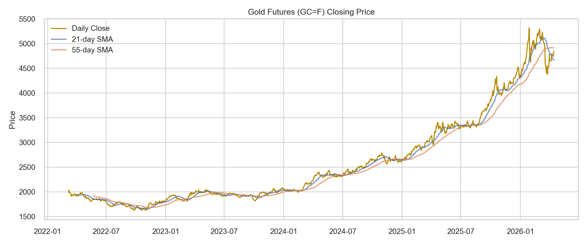
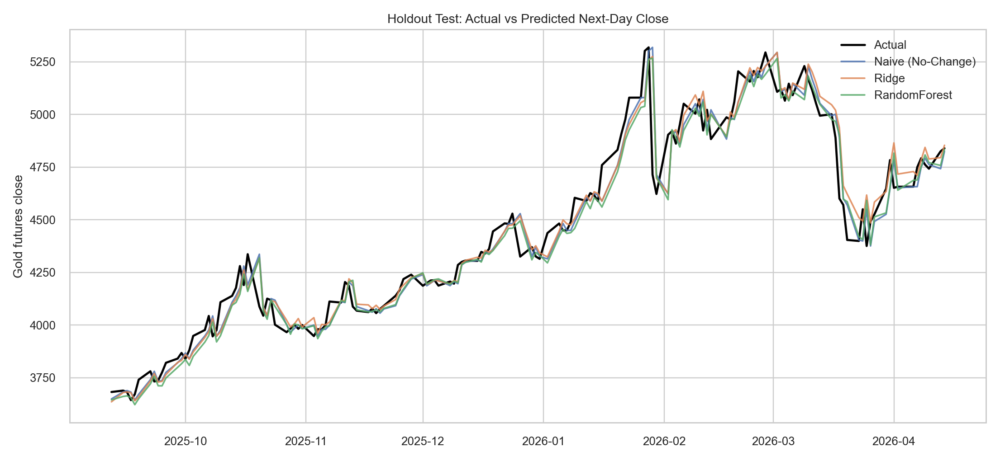
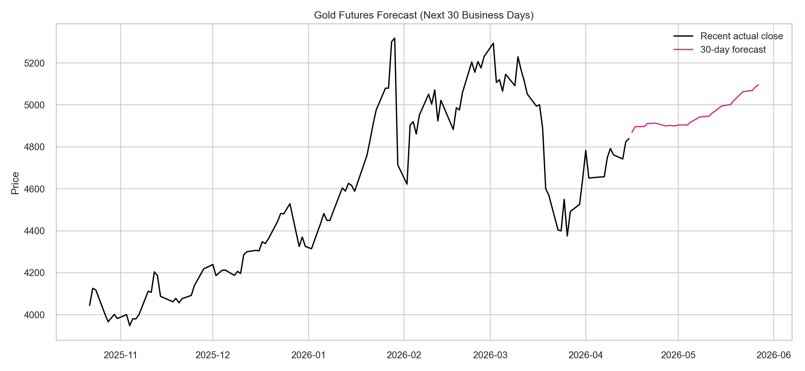

# Gold Commodity Price Prediction (4-Year Analysis)

An end-to-end time-series forecasting project for **gold futures** using the latest 4 years of historical data.  
The project downloads online market data, builds forecasting features, compares models, and generates a publication-ready report.

## Project Highlights

- **Data source:** Yahoo Finance (`GC=F`)
- **Coverage:** ~4 years (latest available window)
- **Pipeline:** Data download → EDA → feature engineering → model training/evaluation → 30-day forecast
- **Deliverables included:**
  - `gold_price_prediction_4y_complete.ipynb` (main notebook)
  - `project_report.tex` (full LaTeX report)
  - `artifacts/` (metrics, CSVs, and plots)

## Repository Structure

```text
.
├── artifacts/
│   ├── forecast_next_30d.png
│   ├── future_forecast.csv
│   ├── gold_close_history.png
│   ├── metrics_summary.json
│   ├── test_actual_vs_pred.png
│   ├── test_predictions.csv
│   ├── test_results.csv
│   └── validation_results.csv
├── gold_price_prediction_4y_complete.ipynb      # primary complete notebook
└── project_report.tex             # final report
```

## Model Comparison (Holdout Test)

| Model | MAE | RMSE | MAPE (%) | R² | Directional Accuracy (%) |
|---|---:|---:|---:|---:|---:|
| Naive (No-Change) | 64.10 | **96.50** | **1.41** | **0.9542** | **60.54** |
| Ridge | 65.48 | 97.65 | 1.44 | 0.9531 | 51.02 |
| RandomForest | 67.98 | 99.94 | 1.50 | 0.9509 | 48.98 |

> The no-change baseline achieved the lowest test RMSE; the notebook uses **Ridge** as the best non-naive model for recursive forward forecasting.

## Forecast Summary

- Latest observed close: **4839.60**
- 30-business-day forecast endpoint (Ridge path): **5096.09**
- Approximate projected change: **+5.31%**

## Quick Start

### 1. Create environment and install dependencies

```bash
python3 -m venv .venv
source .venv/bin/activate
pip install --upgrade pip
pip install pandas numpy matplotlib seaborn scikit-learn yfinance nbformat nbconvert ipykernel statsmodels
```

### 2. Register notebook kernel

```bash
python -m ipykernel install --user --name gold-price-venv --display-name "Python (gold-price-venv)"
```

### 3. Execute the notebook end-to-end

```bash
jupyter nbconvert --to notebook --execute --inplace \
  --ExecutePreprocessor.kernel_name=gold-price-venv \
  gold_price_prediction_4y_complete.ipynb
```

This command refreshes all outputs and regenerates files in `artifacts/`.

## Visual Outputs

### Gold Price History


### Holdout Test: Actual vs Predicted


### 30-Day Forecast


## Notes

- The pipeline is designed to be reproducible and avoids temporal leakage by using chronological splits.
- Since prices are highly persistent, strong naive baselines are expected in short-horizon forecasting.
- You can extend this project with macroeconomic/exogenous features (USD index, rates, inflation, ETF flows, geopolitical events) for potentially better directional modeling.
